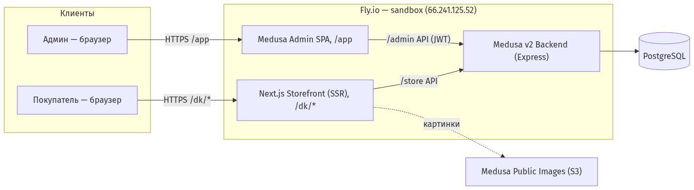
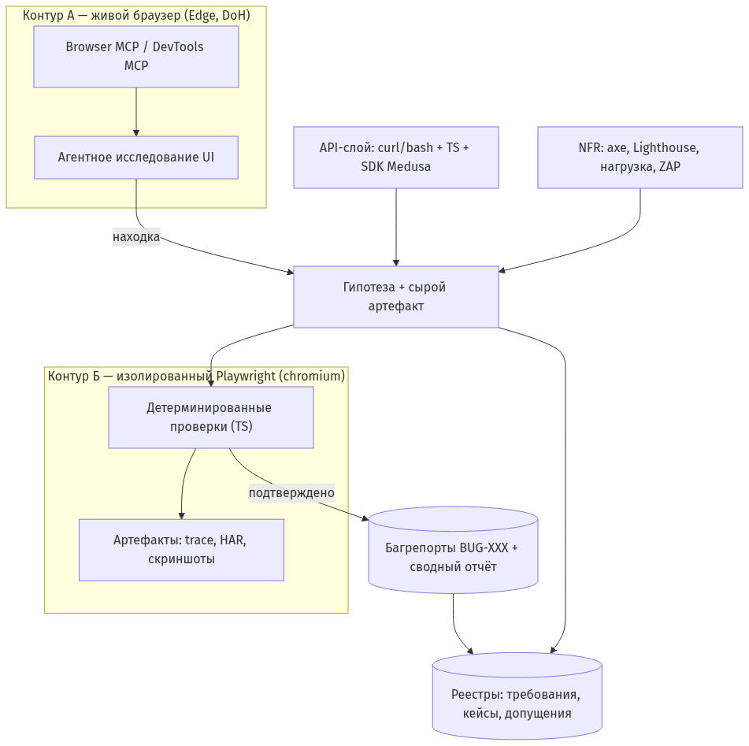
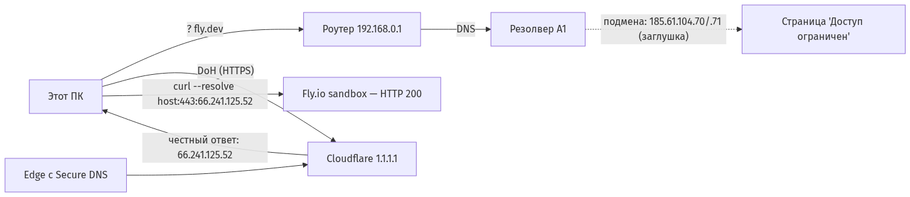
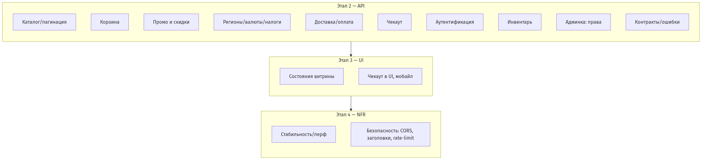
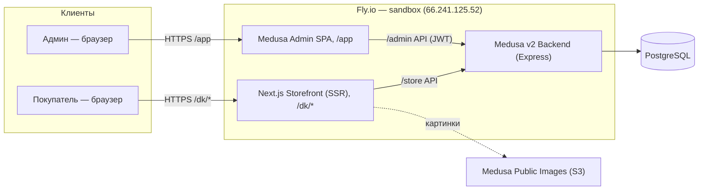
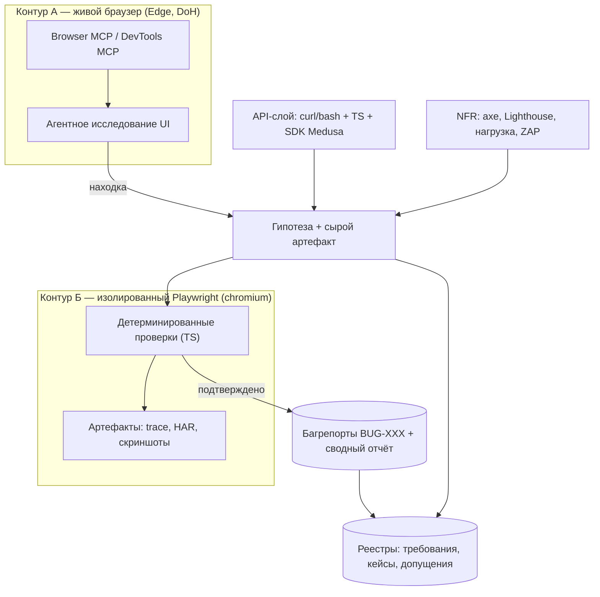
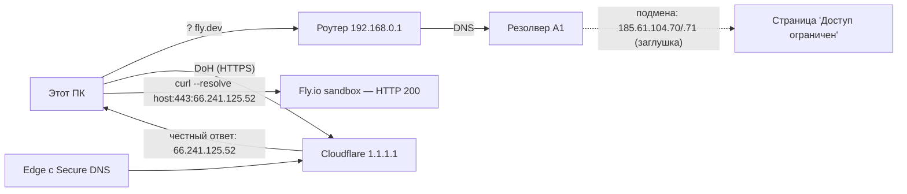
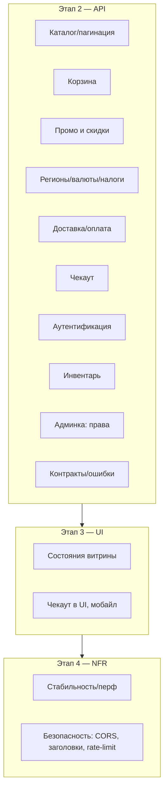

# Диаграммы проекта

> Живые PNG — ниже; исходники Mermaid — в конце файла (GitHub рендерит их тоже).

## PNG-галерея

---

## Исходники Mermaid

## 1. Архитектура цели

## 2. Стратегия: два контура и поток находок

## 3. Окружение: DNS-блокировка и обход

## 4. Карта рисков (14 областей, порядок этапов)

